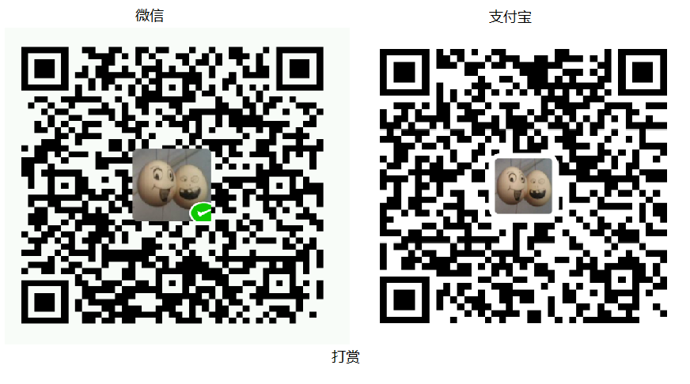

# KRCD v4 alpha版

楼主最近头发掉的越来越多，所以需要休息一段时间。有事儿请邮箱：[dd@sodiao.org](mailto://dd@sodiao.org)在线演示：[http://krcd4.sodiao.org/](http://krcd4.sodiao.org/)

讨论群：370844065（有消息会在上面发布）

## 新增功能

1. 打印、续打；
2. 修订模式（留痕）；
3. 支持全键盘操作；
4. 控件对象化，提供更丰富的接口（控件联动）
5. ……功能多到我自己都忘了……

## KRCD对象本身的接口文档

1. [KRCD初始化时的options文档](./doc/krcd.options.md)
2. [KRCD实例接口文档](./doc/krcd.api.md)

## KRCD控件文档：

1. [KRCD控件文档](./doc/krcd.ctrl.api.md)

## 想到了在补充

## 需求&bug 提交

1.  可邮件至[dd@sodiao.org](mailto://dd@sodiao.org/)；

## 打赏

